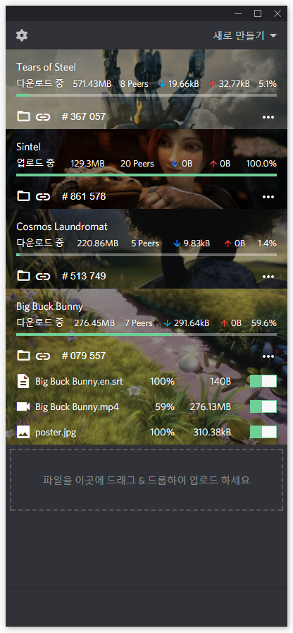
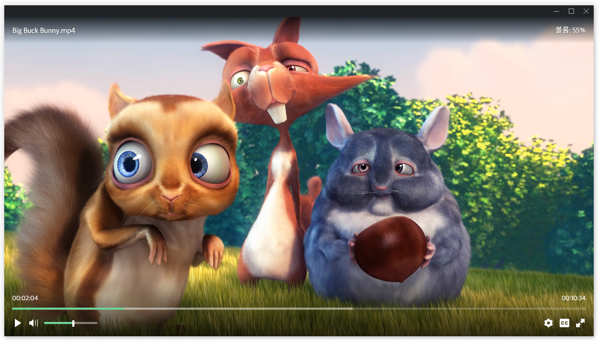

<h1 align="center">
  <br>
  <br>
  MIMIC
  <br>
  <br>
</h1>

<br>




**MIMIC**은 **BitTorrent** 및 [WebTorrent](https://github.com/webtorrent/webtorrent)를 지원하는 스트리밍 토렌트 클라이언트 입니다.

### 특징
* 가볍고 빠른 토렌트 클라이언트
* 익숙한 UI/UX
* 무료, 광고없음, 오픈소스
* windows 및 mac OS 지원
* 비디오 및 오디오 실시간 스트리밍
  * MP4, MKV, WEBM 지원
  * SMI, SRT, VTT 등 자막 지원
  * ~~360° Video~~
  * ~~AirPlay, Chromecast~~
* 웹 브라우저에 연결하기 위한 [WebTorrent](https://github.com/webtorrent/webtorrent)프로토콜 지원

※ 진행 상황: 65%  
실행 영상 [Youtube](https://www.youtube.com/watch?v=ZkS1ClJZkH8)  

현재 로고 작업중인 상태이고 나오기 전까지 [mimic-experiment](https://github.com/akustar/mimic-experiment)이 곳에서 잠시 테스트합니다.

### 설치

```bash
git clone
cd mimic-desktop
yarn # or npm install
yarn run dev # or npm run dev
```

This project was generated with [electron-vue](https://github.com/SimulatedGREG/electron-vue) using [vue-cli](https://github.com/vuejs/vue-cli). Documentation about the original structure can be found [here](https://simulatedgreg.gitbooks.io/electron-vue/content/index.html).
